# Android---project

#收集的一些开源项目.

0.android material design 风格项目整理.    
项目地址:https://github.com/soyoungboy/android-material-design-Open-source-projects/tree/master

1.Android 开源项目第一篇----个性化控件(View)篇     
包括ListView、ActionBar、Menu、ViewPager、Gallery、GridView、ImageView、ProgressBar、TextView、ScrollView、TimeView、TipView、FlipView、ColorPickView、GraphView、UI Style、其他         
Android 开源项目第二篇——工具库篇                 
包括依赖注入、图片缓存、网络请求、数据库,ORM工具包、Android公共库、高版本向低版本兼容库、多媒体、事件总线、传感器、安全、插件化、文件、其他               
Android 开源项目第三篇——优秀项目篇:比较有意思的完整的 Android 项目.     
Android 开源项目第四篇——开发及测试工具篇          
包括开发效率工具、开发自测相关、测试工具、开发及编译环境、其他           
Android 开源项目第五篇——优秀个人和团体篇        
乐于分享并且有一些很不错的开源项目的个人和组织，包括 JakeWharton、Chris Banes、Koushik Dutta 等大牛.      
项目地址:https://github.com/Trinea/android-open-project

2.妹纸Android客户端:每天自动更新一张精选妹纸图、一个小视频、一系列精选程序猿干货（周末不更新）。数据来自代码家的干货网站：http://gank.io;  https://github.com/drakeet/Meizhi                     

3.一款免费,强大而优雅的Android端音乐播放器.      
https://github.com/psaravan/JamsMusicPlayer       
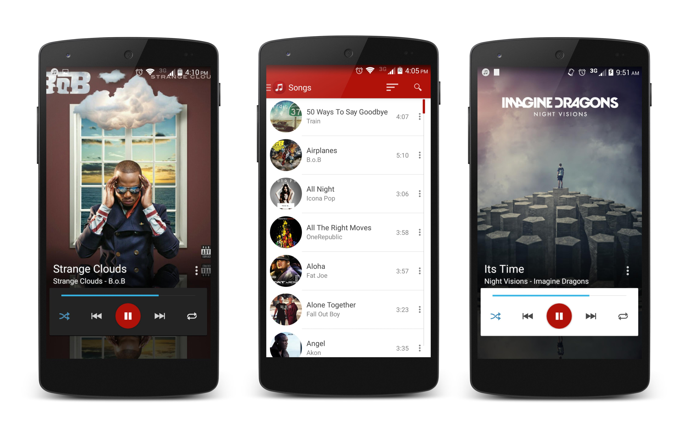

4.SimplifyReader:一款基于Google Material Design设计开发的Android客户端，包括新闻简读，图片浏览，视频爽看 ，音乐轻听以及二维码扫描五个子模块。     https://github.com/SkillCollege/SimplifyReader     

5.Purified version of Zhihu Daily - 更纯净的知乎日报.      
https://github.com/izzyleung/ZhihuDailyPurify    
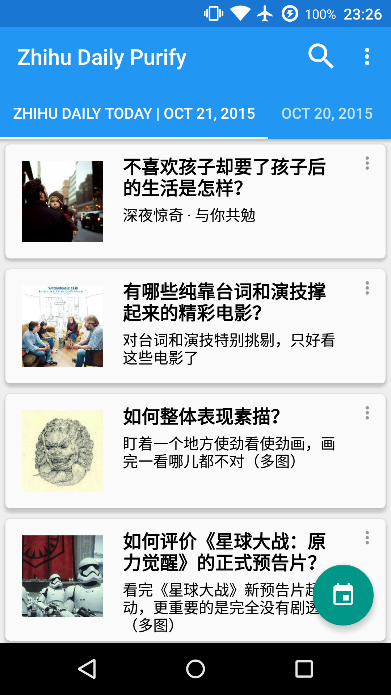

6.知乎专栏App.https://github.com/bxbxbai/ZhuanLan    

7.V2EX社区客户端，非官方。https://github.com/greatyao/v2ex-android     

8.MD风格的36氪Android阅读客户端.https://github.com/kinneyyan/36krReader      

9.一个仿知乎日报客户端 - 新奇日报.没有让人皱眉的启动页广告，没有后台的消息推送，只提供最初的阅读功能。       
https://github.com/cundong/ZhihuPaper            

10.一个符合 Google Material Design 的 Android 校园新闻客户端.https://github.com/sues-lee/SuesNews

11.FineDay-A simple weather app;一个简单的天气预报app;https://github.com/sd6352051/FineDay
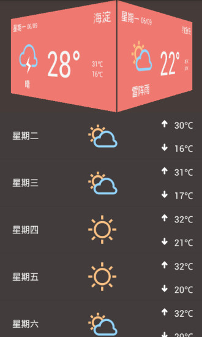
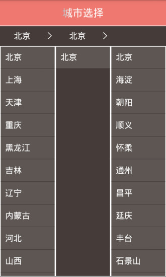

12.Ruby-China的Android客户端 http://ruby-china.org/.https://github.com/gonjay/rubychina4android

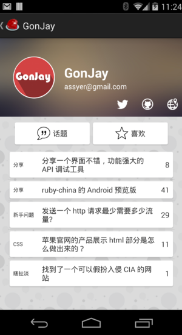

13.A project which demonstrate how to develop a custom client on android for dribbble.com;
https://github.com/tuesda/Watch         

14.a Dribbble client for android, building in android studio.https://github.com/NovelanceF/Dribbble_rebuild     
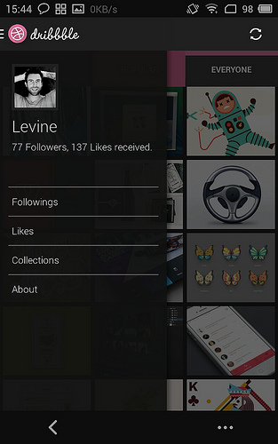
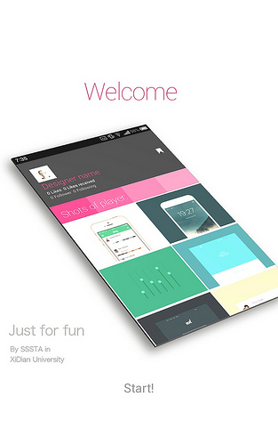

15.彩阅.新闻源来自于新华网，人民网RSS源。实现了简单的新闻添加功能。 后台数据库使用BMOB云。实现了查询，排序，上传功能。 分享使用友盟，实现了微博，qq好友的分享。 图片列表使用第三方库实现CardView效果。 
项目地址:http://www.devstore.cn/code/info/1293.html           
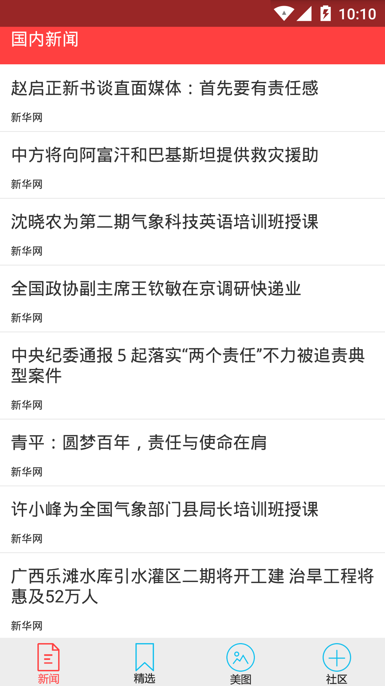

16.干柴 - android client, php server;专注于Android干货资源.https://github.com/openproject/ganchai             
,

17.一个遵循Material Design的一个设计新闻客户端，里面的一些完全MD的一些特效很棒，同时整个客户端的框架设计也很有参考意义。https://github.com/nickbutcher/plaid           

18.爱看博客Android客户端,爱看博客是个人博客平台客户端，你也可以访问http://blog.kymjs.com查看博客。           
项目地址:https://github.com/KJFrame/KJBlog     

19.GankDaily,每日提供技术干货的App。为学习使用 MVP、RxJava、Retrofit 等知识点，仿照 @drakeet 的妹纸， 使用 MVP 模式对项目进行重构，让视图层跟业务逻辑向分离，使代码结构更清晰。             
项目地址:https://github.com/maoruibin/GankDaily                

20.一个基于Material Design的待办事件列表App.https://github.com/hanks-zyh/Conquer          

21.A material Date Range Picker based on wdullaers MaterialDateTimePicker.          
项目地址:https://github.com/borax12/MaterialDateRangePicker           

  

22.github客户端.https://github.com/pockethub/PocketHub              

23.批量上传照片到facebook.https://github.com/chrisbanes/photup           

24.eoe的Android客户端源码.https://github.com/eoecn/android-app           

25.Sina Weibo Android Client.https://github.com/qii/weiciyuan           
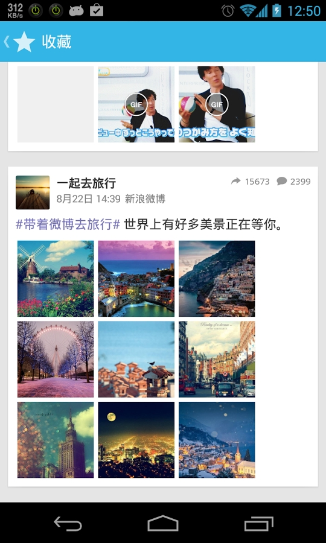
           

26.煎蛋”Android版的高仿.https://github.com/ZhaoKaiQiang/JianDan            
           

27.Modern, easy and customizable app manager for Android with Material Design.应用管理工具.              
项目地址:https://github.com/javiersantos/MLManager                 
              

28.AppPlus is a open source android application,and used to manage app,export apk,watch recent processes.    App+是一个主要用于Android用户间传送Apk文件的工具软件。当你手机中有一款不错的软件，然后你朋友也想在自己手机上体验一下，此时，通常的做法是让你的朋友去软件市场下载该软件。但是，如果此刻能直接把这个软件的安装包发送到对方的手机，岂不是更加方便、省时、省流量。                               
项目地址:https://github.com/maoruibin/AppPlus                      

        

29.CoCoin是一款记账APP，有记账、多种方式显示支出占比和支出变化、云同步、智能提醒等功能。                           
项目地址:https://github.com/Nightonke/CoCoin                                              

 
 

**30.WeiBo:高仿新浪微博客户端**                     
项目地址:https://github.com/wenmingvs/WeiBo       

   

**31.PhotoNoter**             
Design风格的开源照片笔记。(MVP+Dagger2+RxJava+Dex分包异步加载)      
项目地址:https://github.com/lyxwll/PhotoNoter          

                          

**32.A Material Design app for douban.com**
开源的 Material Design 豆瓣客户端（A Material Design app for douban.com）。          
项目地址:https://github.com/DreaminginCodeZH/Douya                 

**33.趣刻 Android APP**
项目地址:https://github.com/hugeterry/coderfun                           

**34.采用MVP架构的仿知乎APP**
项目地址:https://github.com/fangx/ZhiHuMVP          

          

**35.OuNews 一个由学习之用而来的新闻阅读开源App**  
项目地址:https://github.com/oubowu/OuNews   

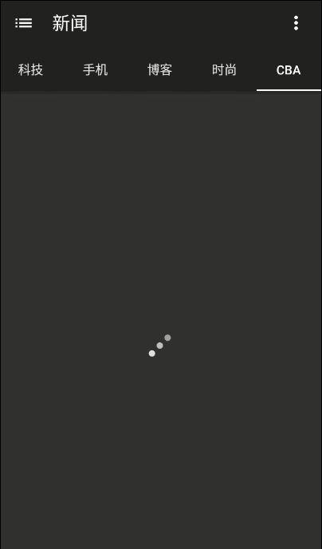

**36.NewsMe 私人定制新闻**        
项目地址:https://github.com/iQuick/NewsMe      
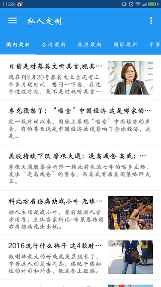
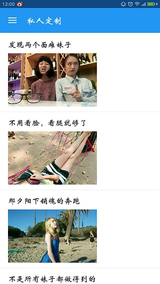
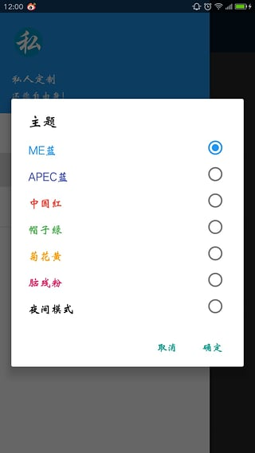        

**37.LeetCoder is an awesome app for (including unlock) problems, solutions, discuss(from leetcode) and comments.**
项目地址:https://github.com/Nightonke/LeeCo           

**38.知乎日报 RRD(Retrofit,RxJava,Dagger2)**             
这是一个使用Retrofit RxJava Dagger2创建的简单示例。                                         
项目地址:https://github.com/lsxiao/ZhihuDailyRRD              
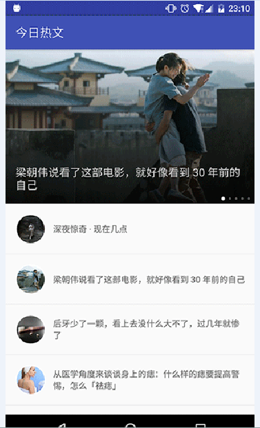

         

**39.A lightweight Youtube frontend for Android.**     
项目地址:https://github.com/theScrabi/NewPipe          

     

**40.DroidKaigi 2016 official Android conference app in Tokyo.**     
项目地址:https://github.com/konifar/droidkaigi2016       

          

**41.MaterialNotes:Powered by MIUI Notes**     
项目地址:https://github.com/songhanghang/MaterialNotes       
  

**42.非官方版“一个(ONE)”，一个比官方版更优秀的版本**      
项目地址:https://github.com/Uphie/ONE-Unofficial       

        

**43.RxJava+RxAndroid+Retrofit+Glide+Material Design Weather App:octocat:**    
项目地址:https://github.com/xcc3641/SeeWeather      

    

**44.Material Design风格的众筹app**     
项目地址:https://github.com/byoutline/kickmaterial    
  
  

**45.一个react-native写的github客户端**     
项目地址:https://github.com/xiekw2010/react-native-gitfeed     
    

**46.一款优雅的干货集中营Android客户端，实现了沉浸式状态栏，无缝换肤，带3D感觉的侧滑菜单**      
项目地址:https://github.com/dongjunkun/GanK        

     

**47.一个看妹纸与开发资讯的Android APP，具有本地缓存、分享与添加收藏的功能。**       
项目地址:https://github.com/IvorHu/RealStuff        

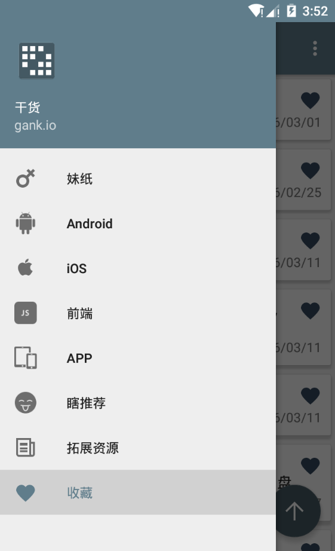      

**48.使用data binding , dagger2 , retrofit2和rxjava实现的，基于MVVM的知乎日报APP。**     
https://github.com/liuguangqiang/Idaily       

            

**49.一款基于Material Design 设计的开源笔记本应用**     
https://github.com/lguipeng/Notes      

   

**50.一个用Kotlin写的简单漫画APP**      
https://github.com/wuapnjie/PoiShuhui-Kotlin      

**51.一个表白墙项目 采用MVP设计模式，网络框架主要是Glide加上Okhttp**     
https://github.com/1036711153/ConfessWall/          

**52.集视频，图片和文章的娱乐app,数据来源于优酷，暴走tv，全球动画精选以及其他网站。**      
https://github.com/panjichang/weishijie-develop

**53.Android干货妹子APP,MVP框架**     
https://github.com/dalingge/GankGirl      

**54.DMPLayer is an Android music player prototype**     
https://github.com/dibakarece/DMPlayer      
   

**55.ListenRain/听雨 一个开源资讯 App(Android)**      
https://github.com/laobie/ListenRain    
   

**56.gank是干货集中营非官方客户端，主要练习RxJava、RxAndroid、Retrofit & MVP**     
https://github.com/xybCoder/gank      
   

**57.一个小而美的阅读客户端:MicroReader**        
https://github.com/YiuChoi/MicroReader

**58.Material 风格的干货客户端**              
https://github.com/v1210012100/Gank.IO2              

**59.A third party app for androidweekly.net**        
https://github.com/mzule/AndroidWeekly            

**60.一款以兴趣为驱动的陌生人社交app**           
https://github.com/Chenantao/PlayTogether            

**61.基于Gank.IO提供的API的第三方客户端**                   
https://github.com/burgessjp/GanHuoIO               

**62.RxJava+Retrofit+Glide构建的gank.io第三方客户端，包含妹子图和技术干货等。**               
https://github.com/gaolonglong/GankGirl                     

**63.基于Material Design和MVP的新闻客户端 https://github.com/liuling07/SimpleNews/raw/master/SimpleNews.apk**      
https://github.com/liuling07/SimpleNews     

**64.EasyGank妹纸:Base on the MVP pattern , RxJava+RxAndroid+Retrofit .**    
https://github.com/CaMnter/EasyGank     

**65.咚咚，一款专注团队高效沟通的移动客户端(环信)**    
https://github.com/caisiyi/SYTeamApp     

**66.一个集Gank.Io，Rxjava示例，操作符,MD控件使用,各种好玩Ap示例的学习App**                  
https://github.com/HotBitmapGG/StudyProject               

**67.DMGameApp是一款基于3DMGAME的一个游戏门户app**                  
https://github.com/xiaohaibin/DMGameApp            

**68.这个repo是YouJoin社交平台的Android客户端**                 
https://github.com/FreedomZZQ/YouJoin-Android           

**69.书柜：一款用于管理个人图书及阅读笔记的移动 Android 应用。**    
https://github.com/iHaPBoy/BookShelf      

**70.Popular-Movies-App: A simple Android app, that helps you discover most popular and most rated movies.**    
https://github.com/maksim-m/Popular-Movies-App     

**71.简洁美观的干货集中营(gank.io)的非官方安卓客户端**      
https://github.com/JohnnyShieh/Gank    

**72.高仿 爱范儿**              
https://github.com/iCodeForever/ifanr                  

**73.gank.io unofficial client, RxJava & Retrofit**
https://github.com/drakeet/Meizhi   

**74.A amazing, minimalist reading information app**    
https://github.com/xinghongfei/LookLook    

**75.这个开源项目展示了如何实现一个横跨各种Android平台的音乐播放器，包括手机，平板，汽车，手表，电视等。Google官方推出，跨平台开发必看项目。**   
https://github.com/googlesamples/android-UniversalMusicPlayer    

**76.由谷歌工程师开发，展示Google Material风格设计，项目代码量大，但是结构清晰，还是很好理解的。**    
https://github.com/nickbutcher/plaid     

**77.“面对面文件快传”，Android端灵动快传，安卓互传文件，局域网，无网传输文件，Android，file transfer**    
https://github.com/zhoubowen-sky/LingDong2.0              

**78.电影App: Awesome material designed movie app powered by tmdb and trakt.**             
https://github.com/salRoid/Filmy                

**79.极客日报，一款纯粹的阅读App，基于Material Design + MVP + RxJava + Retrofit + Dagger2 + Realm + Glide**            
https://github.com/codeestX/GeekNews                

**80.A stylish music player for android device 16+**               

**81.一个完整的生日管理 App: UPMiss(思念之夏)**        
https://github.com/qiujuer/UPMiss              

**82.“任阅”，开源小说阅读器，实现追书推荐收藏、书籍/标签检索、模拟翻书的翻页效果、缓存书籍、日夜间模式、本地书籍阅读、字体/主题/亮度设置、Wifi传书等功能！**          
https://github.com/JustWayward/BookReader          

**83.完整的NBA第三方Android客户端，包含NBA头条新闻、视频集锦/赛场花絮、比赛直播（目前支持比赛前瞻、文字直播、球队及球员技术统计）、球队战绩排行、球员数据排名、虎扑论坛专区（已实现发帖与回复功能）、球队及球员的详细资料。**      
 http://blog.csdn.net/yyh352091626/article/details/52093351   
https://github.com/smuyyh/SprintNBA                 

**84.Bgm38 Android 客户端**         
https://github.com/zubinxiong/Bgm38         

**85.Girls : an App for some picture**                   
https://github.com/flyou/Girls          

**86.仿网易云音乐 安卓版，netease android，音乐播放器 在线 下载**          
https://github.com/lyxwll/remusic                  

**87.『假装看天气』─── 天气预报 & 公交查询 & 资讯阅读 & 妹纸福利 的 Android 客户端**      
https://github.com/li-yu/FakeWeather

**88.一款模仿开眼视频 Android 版本的客户端**            
https://github.com/Assassinss/Interessant       

**89.简诗 一款优雅的中国风Android App，包括Android端和Server端，支持登录注册，数据云端同步，离线数据存储和截屏分享等功能。**     
https://github.com/wingjay/jianshi

**90.高仿爱壁纸App | Material Design**     
https://github.com/LiuGuiLinAndroid/LoveWallpaper

**91.**
 

